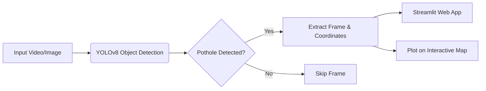

# 🚗 Pothole Patrol: AI-Powered Detection & Web Mapping


> An automated computer vision pipeline that detects potholes from dashcam footage using YOLO and dynamically maps their coordinates on an interactive web map.

<div align="center">
  <!-- TODO: Add a GIF of your working project here -->
  
</div>

## 📌 Problem Statement
Potholes cause severe vehicle damage and road accidents globally. Identifying and mapping them manually is slow and inefficient. This project automates the process by analyzing dashcam videos, detecting potholes in real-time, and plotting their locations on a live map for urban planning and public safety.

## ✨ Key Features
- **Real-Time Detection:** Utilizes YOLOv8 for fast and highly accurate pothole detection.
- **Dynamic Web Mapping:** Automatically extracts location data and plots red hazard pins on an interactive map (Folium/Google Maps).
- **Interactive Dashboard:** A clean, user-friendly web interface built with Streamlit to upload videos and view results instantly.
- **Exportable Data:** Download the detected pothole coordinates as a CSV file for further analysis.

## 🧠 System Architecture



## 🚀 Installation & Setup

1. **Clone the repository:**
   ```bash
   git clone https://github.com/almuzahidseyam/Pothole-Detection-Mapping.git
   cd Pothole-Detection-Mapping
   ```

2. **Create a virtual environment (Optional but recommended):**
   ```bash
   python -m venv venv
   source venv/bin/activate  # On Windows use `venv\Scripts\activate`
   ```

3. **Install the dependencies:**
   ```bash
   pip install -r requirements.txt
   ```

4. **Run the Application:**
   ```bash
   streamlit run app.py
   ```

## 🛠️ Tech Stack
- **Deep Learning:** Ultralytics YOLOv8
- **Computer Vision:** OpenCV
- **Frontend/Dashboard:** Streamlit
- **Mapping:** Folium / Streamlit-Folium

## 🤝 Contributing
Contributions, issues, and feature requests are welcome! Feel free to check the issues page.

## 📝 License
This project is licensed under the MIT License.
