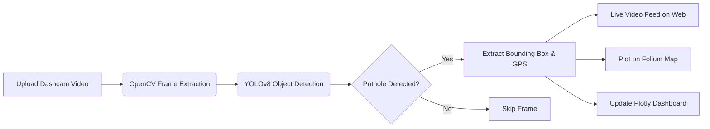

# 🚗 Pothole Patrol: Enterprise Infrastructure Mapping


> An enterprise-grade AI computer vision pipeline that detects potholes from dashcam footage in real-time, maps them using geospatial intelligence, and provides a data analytics dashboard.

<div align="center">
  <!-- TODO: Add a GIF of your working project here -->
  
</div>

## 📌 Problem Statement
Potholes cause severe vehicle damage and road accidents globally. Identifying and mapping them manually is slow and inefficient. This project automates the process by analyzing dashcam videos, running frame-by-frame object detection, and plotting their locations on a live map for urban planning and public safety.

## ✨ Premium Features
- **Real-Time Video Analytics:** Utilizes `OpenCV` and `YOLOv8` to process dashcam telemetry frame-by-frame, visualizing bounding boxes directly on the web app.
- **Geospatial Intelligence:** Automatically extracts location data and plots hazard levels (High/Medium/Low) on a dynamic `Folium` Dark Matter map using color-coded CircleMarkers.
- **Enterprise Dashboard:** A 3-tab architecture built with `Streamlit` featuring Video Analytics, Live Mapping, and a comprehensive Data Dashboard.
- **Data Analytics:** Interactive charts powered by `Plotly Express` showing Hazard Severity Distribution and Confidence Scores.
- **Exportable GIS Data:** Download detected pothole coordinates as a CSV file for ingestion into QGIS or ArcGIS.

## 🧠 System Architecture



## 🚀 Installation & Setup

1. **Clone the repository:**
   ```bash
   git clone https://github.com/almuzahidseyam/Pothole-Detection-Mapping.git
   cd Pothole-Detection-Mapping
   ```

2. **Create a virtual environment:**
   ```bash
   python -m venv venv
   source venv/bin/activate  # On Windows use `venv\Scripts\activate`
   ```

3. **Install dependencies:**
   ```bash
   pip install -r requirements.txt
   ```

4. **Run the Application:**
   ```bash
   streamlit run app.py
   ```
*(The pre-trained YOLOv8n model is included, so the app works out of the box).*

## 🛠️ Tech Stack
- **Deep Learning:** Ultralytics YOLOv8
- **Computer Vision:** OpenCV (`cv2`)
- **Frontend/UI:** Streamlit
- **Mapping:** Folium / Streamlit-Folium
- **Analytics:** Plotly / Pandas

## 🤝 Contributing
Contributions, issues, and feature requests are welcome! Feel free to check the issues page.

## 📝 License
This project is licensed under the MIT License.
